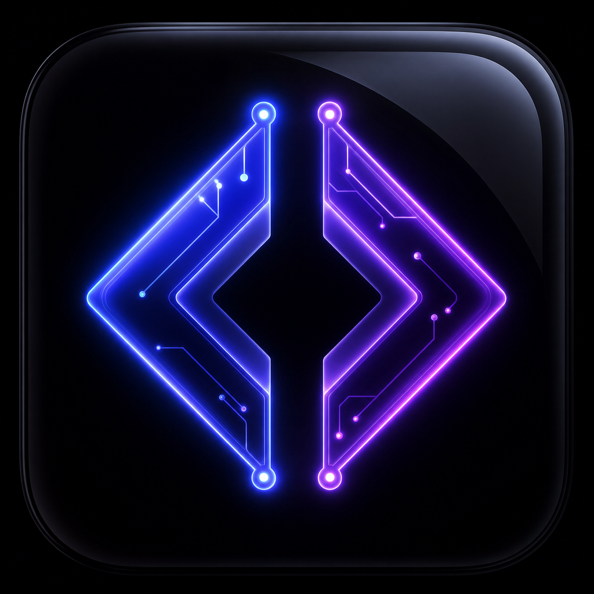

<p align="center">
  
</p>

<h1 align="center">DevOS</h1>

<p align="center">
  <strong>A next-generation mobile OS for developers</strong><br/>
  Projects · AI Assistant · Notes · Analytics · Collaboration
</p>

<p align="center">
  
  
  
  
  
</p>

---

## ✨ Features

| Feature | Description |
|---------|-------------|
| 🔐 **Authentication** | Email, Google & GitHub login via Supabase Auth |
| 📋 **Projects & Tasks** | Kanban-style project management with priorities |
| 🤖 **AI Assistant** | Built-in AI coding companion |
| 📝 **Notes** | Rich markdown notes with color labels & pinning |
| 📊 **Dashboard** | Real-time productivity analytics |
| 👤 **Profile** | Settings, themes & account management |

## 🛠️ Tech Stack

- **Framework:** Expo SDK 53 + React Native 0.79
- **Navigation:** Expo Router v6 (file-based)
- **Backend:** Supabase (Auth, PostgreSQL, Storage, Realtime)
- **State:** React Context + AsyncStorage (offline-first)
- **UI:** Custom design system — AMOLED dark theme, glassmorphism
- **Animations:** React Native Reanimated 4
- **Monorepo:** pnpm workspaces

## 🚀 Getting Started

### Prerequisites

- Node.js 20+
- pnpm 9+
- Expo CLI
- Supabase account

### 1. Clone the repo

```bash
git clone https://github.com/omar232208/App-DevOS.git
cd App-DevOS
```

### 2. Install dependencies

```bash
pnpm install
```

### 3. Configure environment

```bash
cp artifacts/mobile/.env.example artifacts/mobile/.env.local
```

Fill in your Supabase credentials:

```env
EXPO_PUBLIC_SUPABASE_URL=https://your-project.supabase.co
EXPO_PUBLIC_SUPABASE_ANON_KEY=your-anon-key
```

### 4. Start the dev server

```bash
pnpm --filter @workspace/mobile run dev
```

Scan the QR code with **Expo Go** on your phone.

## 📁 Project Structure

```
App-DevOS/
├── artifacts/
│   └── mobile/                    # Expo app
│       ├── app/                   # File-based routing (Expo Router)
│       │   ├── (auth)/            # Auth screens
│       │   │   ├── welcome.tsx    # Onboarding
│       │   │   ├── login.tsx      # Login
│       │   │   └── register.tsx   # Register
│       │   ├── (tabs)/            # Main app tabs
│       │   │   ├── index.tsx      # Dashboard
│       │   │   ├── projects.tsx   # Projects & Tasks
│       │   │   ├── ai.tsx         # AI Assistant
│       │   │   ├── notes.tsx      # Notes
│       │   │   └── profile.tsx    # Profile & Settings
│       │   └── _layout.tsx        # Root layout
│       ├── components/            # Shared UI components
│       │   └── ui/
│       │       ├── GlassCard.tsx
│       │       ├── GradientButton.tsx
│       │       ├── Badge.tsx
│       │       └── ProgressRing.tsx
│       ├── constants/             # Design tokens
│       ├── context/               # React context providers
│       ├── hooks/                 # Custom hooks
│       └── assets/                # Fonts, icons, images
├── artifacts/api-server/          # Optional Express API
└── package.json                   # pnpm workspace root
```

## 🗄️ Database Schema

```sql
-- Users (handled by Supabase Auth)
-- Projects
create table projects (
  id uuid primary key default gen_random_uuid(),
  user_id uuid references auth.users not null,
  name text not null,
  description text,
  color text default '#6366F1',
  status text default 'active',
  progress int default 0,
  created_at timestamptz default now(),
  updated_at timestamptz default now()
);

-- Tasks
create table tasks (
  id uuid primary key default gen_random_uuid(),
  project_id uuid references projects on delete cascade not null,
  user_id uuid references auth.users not null,
  title text not null,
  status text default 'todo',
  priority text default 'medium',
  created_at timestamptz default now()
);

-- Notes
create table notes (
  id uuid primary key default gen_random_uuid(),
  user_id uuid references auth.users not null,
  title text not null,
  content text default '',
  color text default '#6366F1',
  pinned boolean default false,
  created_at timestamptz default now(),
  updated_at timestamptz default now()
);
```

## 📱 Screenshots

> Coming soon — scan QR with Expo Go to preview live.

## 🤝 Contributing

See [CONTRIBUTING.md](CONTRIBUTING.md) for contribution guidelines.

## 🔒 Security

See [SECURITY.md](SECURITY.md) for security policy.

## 📄 License

MIT © 2026 DevOS. See [LICENSE](LICENSE).
